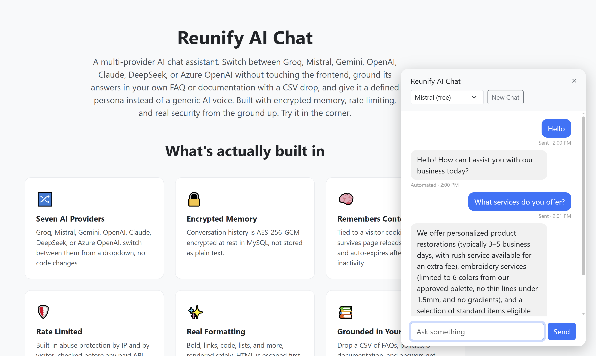
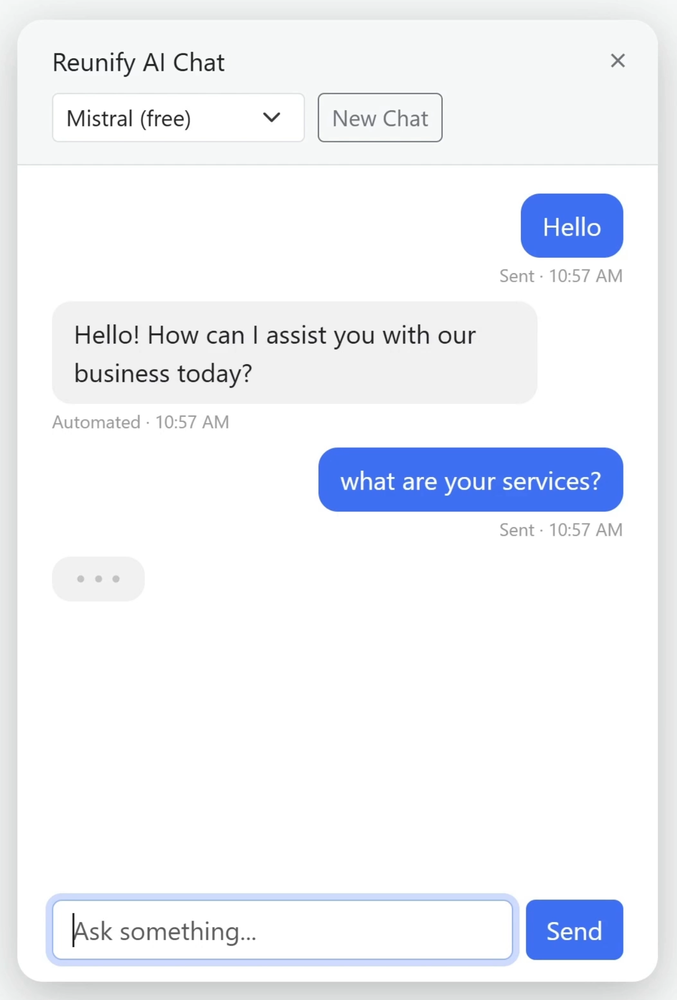

# Reunify AI Chat

A lightweight, multi-provider AI chat harness. Right now it's a working demo you can point at Groq, Mistral, Gemini, OpenAI, Claude, DeepSeek, or Azure OpenAI, and switch between them without touching the frontend. Where it goes from here is open: it's built as a clean template to learn from and adapt, whether that means growing it into a full WordPress/WooCommerce plugin (the eventual plan for this particular build), or repurposing the pieces for something else entirely.

By Rhoel Alcantara.





## Why this exists

This started from a simple question: using nothing but free-to-use AI chat models (Groq and Mistral both have genuine no-cost tiers), how much actual code does it take to build a basic web chat application that remembers conversations and has real security built in, not bolted on after the fact? Something basic-to-mid-level programming knowledge and a PHP server, Windows or Linux, is enough to run and extend?

The answer turned out to be about 1,300 lines of PHP and JavaScript for the core application (roughly 940 once you strip out comments and blank lines), for something with persistent encrypted memory, rate limiting, locked-down file access, and a real authenticated admin endpoint. Small enough to actually read start to finish in an afternoon, not a framework you have to trust blindly.

Most AI chat widget tutorials hardcode one provider and call it done. Here, the provider is just a swappable dependency behind a common interface, so moving from a free-tier provider in development to a paid one in production is a config change, not a rewrite. It's also built assuming it might end up on hosting you don't fully control, shared plans, LiteSpeed instead of stock Apache, no guaranteed SSH, which shaped a few of the choices below.

It's deliberately framework-agnostic at this stage. The `api/` layer doesn't assume WordPress, WooCommerce, or any particular CMS, it's plain PHP with no dependencies, which makes it a reasonable starting point regardless of what you're actually building: a plugin, a standalone widget, or something else entirely. Where it goes from here is genuinely open, adapt it for whatever industry or use case makes sense to you.

## Features

- Seven AI providers behind one interface (`AIProvider`), sharing a common base class where their request formats actually line up
- Persistent, encrypted conversation history, tied to a visitor cookie so it survives reloads and return visits, stored AES-256-GCM encrypted in MySQL, and cleared automatically after 30 days of inactivity
- Replies stream in with a typewriter-style animation and get proper markdown formatting (bold, italic, headings, links, strikethrough, inline code). Everything is HTML-escaped first, and only a small whitelist of safe transformations get applied on top, so nothing an AI provider returns can ever inject real HTML
- Rate limiting by both IP and visitor cookie, checked before any paid API call goes out
- A single authenticated admin endpoint (`api/admin.php`) for key generation, encryption migration, and maintenance, protected by a timing-safe token check
- Responsive down to 320px, with a server-rendered STAGING/LIVE banner that's accurate even before JavaScript loads
- A small automated test suite covering the parts that actually matter: encryption, rate limiting, and markdown-injection safety

## Architecture

```
index.php                    Demo landing page — includes widget.php, nothing more
widget.php                   The chat widget itself: self-contained, includable in any PHP page
widget.css                   Widget styles, external and cacheable — separate from any host page's CSS
chat.js                      Frontend: sending messages, animated reveal, markdown formatting
api/
  chat.php                    Main endpoint — rate limiting -> validation -> provider call -> storage
  admin.php                   Authenticated admin actions (key gen, migration, cleanup, stats)
  config.php                  Secrets (gitignored — copy from config.example.php)
  ProviderFactory.php          Picks a provider implementation by name
  Persona.php                  Builds the persona system prompt, when enabled, in each provider's own required shape
  providers/
    AIProvider.php               Common interface every provider implements
    OpenAICompatible.php         Shared logic for the five OpenAI-shaped providers
    GeminiProvider.php           Gemini's distinct request/response shape
    ClaudeProvider.php           Claude's distinct request/response shape
    ProviderException.php        Structured errors: friendly message + raw details, kept separate
  db/
    Database.php                  PDO connection
    ChatHistoryStore.php          Visitor identification, history read/write
    MessageCipher.php             AES-256-GCM encrypt/decrypt at the storage boundary
    RateLimiter.php               MySQL-backed sliding-window rate limiting
    cleanup.php                   Cron-triggered: purge inactive history + old rate-limit logs
  rag/
    schema.sql                     rag_entries + rag_ingested_files tables
    Embedder.php / GeminiEmbedder.php / MistralEmbedder.php / EmbedderFactory.php
    RagIngestor.php                 CSV ingestion with file- and row-level change detection
    incoming/                       drop CSV files here
tests/
  run.php                        PHP test runner (no PHPUnit dependency required)
  js/markdown.test.js            Markdown formatting + injection-resistance tests
```

### A few choices worth explaining

**Why isn't there one universal provider class?** Gemini and Claude structure their requests differently enough from the OpenAI-style providers, different role names, different nesting, different auth headers, that forcing everything into one shared class would mean scattering provider-specific conditionals through otherwise generic code. Splitting them out keeps each implementation readable on its own terms.

**Why brute-force similarity search instead of a vector database for the RAG layer that's coming next?** It was benchmarked directly: PHP plus MySQL, no index, stays under 200ms through roughly 1,000 to 2,000 entries. That comfortably covers a small business FAQ or policy knowledge base. A dedicated vector database earns its complexity once that ceiling is actually a problem.

**Why openssl instead of sodium for encryption?** Sodium ships with PHP core since version 7.2, but plenty of hosts disable it anyway. OpenSSL is about as close to universally available as a PHP extension gets, since HTTPS itself depends on it.

**Why one admin endpoint instead of a handful of one-off scripts?** A single endpoint with a real, timing-safe token check is easier to reason about and doesn't rely on anyone remembering to delete a file after using it.

## Security model

- Encryption at rest protects against the database being exposed on its own, a leaked backup, a SQL injection that doesn't reach the filesystem, an exposed phpMyAdmin. It doesn't protect against a full server compromise, since the key sits in `config.php` on that same server. Worth knowing where the line actually is.
- Rate limiting works by IP and by cookie. It's appropriate for a small deployment or public demo, not a substitute for real authentication if this ever needs to guard account-level actions.
- The markdown renderer escapes HTML before it does anything else, then applies a narrow whitelist on top. Link URLs are restricted to `http://`, `https://`, and `mailto://`, other schemes are excluded by the pattern itself rather than filtered afterward.
- File access is deny-by-default: every PHP file under `api/` is blocked except the two that need to be reachable. Adding a new class later doesn't require remembering to also block it.

## Using the admin endpoint

`api/admin.php` takes an `action` query parameter and a token passed as an `X-Admin-Token` header, not a URL parameter:

```
curl.exe -H "X-Admin-Token: YOUR_ADMIN_TOKEN" "https://yoursite.com/.../api/admin.php?action=stats"
```
(Mac, Linux, or WSL: drop `.exe`.)

**Windows PowerShell users:** plain `curl` there is aliased to `Invoke-WebRequest`, which won't accept the command above and will throw a `Cannot bind parameter 'Headers'` error. Calling `curl.exe` explicitly sidesteps the alias. If you'd rather use native PowerShell:
```powershell
Invoke-RestMethod -Uri "https://yoursite.com/.../api/admin.php?action=stats" -Headers @{"X-Admin-Token"="YOUR_ADMIN_TOKEN"}
```

This needs a terminal or something like curl or Postman, you can't set custom headers by typing a URL into a browser. That's intentional: keeping the token out of the URL also keeps it out of server access logs and browser history, and avoids a request shape that some automated scanners associate with compromised sites.

Available actions:

**`generate_key`**
```
curl.exe -H "X-Admin-Token: YOUR_ADMIN_TOKEN" "https://yoursite.com/.../api/admin.php?action=generate_key"
```
Returns a fresh random key to paste into `CHAT_ENCRYPTION_KEY`.

**`migrate_encrypt`**
```
curl.exe -H "X-Admin-Token: YOUR_ADMIN_TOKEN" "https://yoursite.com/.../api/admin.php?action=migrate_encrypt"
```
Encrypts any plaintext rows left over from before encryption was set up. Safe to run more than once.

**`purge_inactive`**
```
curl.exe -H "X-Admin-Token: YOUR_ADMIN_TOKEN" "https://yoursite.com/.../api/admin.php?action=purge_inactive"
```
Runs the 30-day inactivity cleanup on demand, same logic as the daily cron job.

**`stats`**
```
curl.exe -H "X-Admin-Token: YOUR_ADMIN_TOKEN" "https://yoursite.com/.../api/admin.php?action=stats"
```
Returns visitor, message, and rate-limit-log counts, plus total tokens used across everything, a quick health check.

**`token_usage`**
```
curl.exe -H "X-Admin-Token: YOUR_ADMIN_TOKEN" "https://yoursite.com/.../api/admin.php?action=token_usage"
```
Returns overall token totals plus a per-conversation breakdown (highest first), how many tokens each individual visitor's conversation has consumed, accumulated across every turn. Only assistant replies carry token data, since that's what the provider's API actually reports; not every provider guarantees this field, so a `null`/`0` total for a given message means that provider didn't report usage, not that nothing was used. Add `?limit=100` to see more than the default 50 conversations.

## Embedding the widget on your own page

The widget is a single includable component, separate from the demo landing page entirely. To add it to any PHP page:

```php
<?php include '/path/to/reunify-ai-chat/widget.php'; ?>
```

That's the whole integration. `widget.php` loads its own config, connects to its own database for history preload, and emits its own CSS and JS, your page doesn't need to set up any PHP variables or add any other tags first. Place the include anywhere in your page's `<body>`, the bubble is fixed-position and floats in the corner regardless of where the include sits in your markup.

**If your page lives in the same folder as this project**, nothing else is needed. **If you're including it from a page that lives elsewhere on your site** (a different plugin, a theme template, anywhere outside this project's own folder), set `WIDGET_BASE_URL` in `config.php` first:

```php
putenv('WIDGET_BASE_URL=/wp-content/plugins/reunify-ai-chat');
```

This is a real, tested requirement, not a minor detail: without it, the widget's asset links (`chat.js`, `widget.css`) and API calls resolve as relative URLs against whatever page includes it, not against the widget's actual location, so they'd silently 404 the moment the widget is embedded anywhere outside its own folder. `WIDGET_BASE_URL` fixes that by giving every asset link and API call a known, absolute-from-root path to resolve against instead. Verified this specifically: included the widget from a page in a completely different folder, confirmed the asset URLs resolve correctly, and confirmed a real message sent from that foreign page reaches the actual backend and gets stored, not just that the HTML renders.

## Setup

1. Clone the repo and copy the config template:
   ```
   cp api/config.example.php api/config.php
   ```
2. Create a MySQL database, ideally a dedicated one, separate from anything else on the site, and run the schema files in `api/db/`: `schema.sql`, `rate_limit_schema.sql`, `migration_add_error_role.sql`, and `migration_add_token_tracking.sql`. On a fresh install `schema.sql` already includes the token-tracking columns, the migration file is only needed if you already ran the original `schema.sql` before token tracking existed, running it anyway is harmless.
3. Fill in `api/config.php`:
   - At least one AI provider API key. Groq and Mistral both have genuine free tiers with no card required, good starting points.

Where to get a key for each provider (correct as of mid-2026, these pages move around, search "[provider] API key" if a link is dead by the time you read this):

- **Groq**: https://console.groq.com/keys
- **Mistral**: https://console.mistral.ai/api-keys/
- **Gemini**: https://aistudio.google.com/app/apikey
- **OpenAI**: https://platform.openai.com/api-keys
- **Claude (Anthropic)**: https://console.anthropic.com/settings/keys
- **DeepSeek**: https://platform.deepseek.com/api_keys
- **Azure OpenAI**: https://portal.azure.com — more involved, needs an Azure OpenAI resource created first, not just a key page

   - Database credentials (`DB_HOST`, `DB_NAME`, `DB_USER`, `DB_PASS`). If you hit a "permission denied" or "no such file" error connecting, try `127.0.0.1` instead of `localhost` for `DB_HOST`, a common socket-permission mismatch on shared hosting.
   - `ADMIN_TOKEN`, any long random string works, a password manager's generator is fine.
   - `CHAT_ENCRYPTION_KEY`, run `curl.exe -H "X-Admin-Token: YOUR_ADMIN_TOKEN" "https://yoursite.com/.../api/admin.php?action=generate_key"` once and paste the result in.
   - `STAGING_HOSTNAME_KEYWORDS` (optional), controls the STAGING/LIVE banner. Defaults to `staging,dev,test`, checked as a substring of the hostname, adjust it if your staging site uses a different naming convention (e.g. `preprod`).
   - `CHAT_TITLE` (optional), the name shown in the chat header. Defaults to "Reunify AI Chat", change it to your own site or business name.
   - `WIDGET_BASE_URL` (optional), only needed if you're embedding `widget.php` on a page outside this project's own folder — see "Embedding the widget on your own page" above.
   - `RATE_LIMIT_IP_PER_MINUTE`, `RATE_LIMIT_IP_PER_DAY`, `RATE_LIMIT_VISITOR_PER_MINUTE` (optional), rate limit thresholds. Defaults are 20/min per IP, 300/day per IP, 15/min per visitor.
   - `MAX_MESSAGE_LENGTH` (optional), longest message accepted, defaults to 2000 characters.
   - `MAX_HISTORY_MESSAGES` (optional), how many past messages get resent as context on each call, defaults to 20. Higher means better memory but more tokens, and cost, per message.
   - `RAG_EMBEDDING_PROVIDER` (optional), `gemini` or `mistral`, only relevant if you're using the RAG ingestion feature below.
4. Set up a daily cron job running `php api/db/cleanup.php`. This is what actually enforces the 30-day retention and keeps the rate-limit log from growing forever, skip it and things just accumulate.
5. Visit `index.php`. It should just work.

## Testing

No PHPUnit dependency required for the core suite:
```
php tests/run.php              # PHP: encryption, rate limiting, RAG ingestion, RAG retrieval, persona system prompts
node tests/js/markdown.test.js # JS: markdown formatting + injection resistance
```
`tests/run.php` needs `api/config.php` pointed at a real, ideally disposable, test database, most of the suite is inherently database-backed and there's no meaningful way to test it otherwise. Real credentials can be supplied either by editing `config.php` directly, or by setting real environment variables (`DB_NAME`, `DB_USER`, `DB_PASS`, `CHAT_ENCRYPTION_KEY`, etc.) before running PHP, which take precedence over the file's hardcoded defaults, this is how CI runs the suite without needing to edit any files.

Run these from a terminal, never a browser URL. `tests/.htaccess` blocks all web access to the folder, since a test suite that touches your real database has no business being reachable by anyone who stumbles on the URL. No SSH access? Pull the code down and run the same commands against a local or disposable database instead.

Prefer PHPUnit? `composer.json` lists it as a dev dependency (`composer install`, then `composer run test:phpunit`).

## Known limitations

- Rate limiting is per-IP and per-cookie, not account-based, fine for a demo or small deployment, not a substitute for real authentication at larger scale
- Markdown covers the common cases: bold, italic, headings, links, code, strikethrough, bullets, but not tables, fenced code blocks, or blockquotes. Kept deliberately narrow rather than chasing full CommonMark support
- Brute-force similarity search is a reasonable fit up to roughly 1,000-2,000 knowledge base entries, benchmarked, not guessed
- No built-in content moderation on AI replies, appropriate guardrails depend on the deployment and aren't included here
- This is a same-site, PHP-include widget, not a cross-domain embeddable one. Installing it on a completely different domain via a `<script>` tag (the way Intercom or Drift work) would need a different architecture, a CORS-enabled API and a client-side loader, not an extension of the current `include`-based approach

## Giving the assistant a persona

By default the assistant has no defined role, it behaves like a generic AI chat interface. Set a persona in `config.php` to give it a consistent identity instead, a sales associate for your business, a programming tutor, a support agent, whatever fits:

```php
setDefaultEnv('PERSONA_ENABLED', 'true');
setDefaultEnv('PERSONA_PROMPT', 'You are a helpful sales associate for Reunify Studios, a photo restoration and custom apparel business. Be warm and concise, and if you do not know something, say so rather than guessing.');
```

**Want it to stay strictly on-topic** (a sales assistant that shouldn't answer, say, programming questions), not just adopt a tone? Add one more line:
```php
setDefaultEnv('PERSONA_RESTRICT_TOPIC', 'true');
```
This is deliberately a separate toggle from persona itself, off by default even with persona enabled. A persona like "programmer assistant" or "teacher" is *supposed* to range across whatever the user asks, so this isn't bundled automatically, it's opt-in for personas that specifically need a hard scope boundary.

The current date is always told to the model directly, regardless of any of this, so "what's today's date" still works even with strict topic restriction on, that's a baseline accuracy fix, not something this toggle affects.

Off by default, on purpose, anyone who just wants plain chat shouldn't have to configure anything to get it.

**How it's actually sent, correctly, per provider:** this isn't just text glued onto the conversation. Each AI provider has its own real mechanism for this, and using the wrong one either gets silently ignored or throws an outright error:
- OpenAI-compatible providers (OpenAI, Groq, Mistral, DeepSeek, Azure): a `system`-role message
- Gemini: a separate top-level `systemInstruction` field, not a message at all
- Claude: a top-level `system` string field, sending it as a message role actually errors on Claude's API

All three shapes verified directly against each provider's own official documentation and tested against the real `chat.php` flow with a mock provider, confirming the exact configured persona text reaches the model correctly, and that disabling the feature sends no system prompt at all.

**On resisting "ignore all previous instructions" attempts:** whatever you write in `PERSONA_PROMPT` gets automatically wrapped with instructions telling the model to stay in character regardless of what the user says, you don't write that part yourself. Worth being honest about what this actually is: a real, worthwhile mitigation that meaningfully raises the bar against casual override attempts, since modern models are specifically trained to prioritize system-level instructions over user messages. It is **not** a guarantee. No fully bulletproof defense against prompt injection exists anywhere in the industry today, treat this as raising the bar, not as an unbreakable wall.

## RAG: business knowledge retrieval

Drop a CSV into `api/rag/incoming/`, ingest it via `admin.php`, and it actually changes what the AI says, retrieval is wired into `chat.php` directly. When an incoming question is similar enough to something in your knowledge base, the matched entries get injected as context before the AI replies. Verified end-to-end: a question sharing vocabulary with a "Return policy" entry (among three unrelated entries) correctly retrieved that specific entry, not the others, an unrelated question correctly retrieved nothing, and the stored conversation history stays exactly what the visitor typed, the injected context only ever reaches the outgoing API call, never the database.

**CSV format** (see `api/rag/incoming/example.csv`):
```csv
title,content,source_type
"Return policy","Personalized products are final sale except for damage or misprints.","policy"
"Turnaround time","Most restorations take 3 to 5 business days depending on damage.","faq"
```
`title` and `content` are required; `source_type` is optional and just a label for your own organization (filtering, reporting), it doesn't affect retrieval.

**Ingest it:**
```
curl.exe -H "X-Admin-Token: YOUR_ADMIN_TOKEN" "https://yoursite.com/.../api/admin.php?action=rag_ingest"
```

**Change detection, this is real, not just "re-embed everything every time":**
- **File-level**: if a CSV is byte-identical to what's already ingested under the same embedding provider, it's skipped entirely, not even parsed.
- **Row-level**: within a changed file, each row is matched to an existing entry by `(filename, title)`. Unchanged content is skipped (no wasted embedding API call), changed content updates the existing entry and regenerates its embedding, new titles insert a new entry.
- **Switching `RAG_EMBEDDING_PROVIDER` correctly triggers re-embedding**, even with an otherwise-unchanged CSV, tested directly: ingested under one provider, switched providers, re-ran ingestion with zero content changes, confirmed every entry got a fresh embedding under the new provider rather than silently keeping stale, incompatible vectors.
- **Removing a row from the CSV does NOT delete it from the knowledge base.** This is deliberate: auto-deleting on removal risks silently wiping good data from a trimmed or mistakenly-edited file. Deletion isn't built yet, it would need to be explicit.

**Tuning retrieval**, both in `config.php`:
- `RAG_TOP_K` (default 3), how many matching entries get injected per question at most.
- `RAG_MIN_SIMILARITY` (default 0.5), how similar (cosine similarity, 0-1) a match needs to be to count at all. Raise it if answers seem to ignore clearly-relevant entries by pulling in weak matches alongside them; lower it if relevant entries aren't being found.
- `RAG_MIN_QUERY_LENGTH` (default 15 characters), messages shorter than this skip RAG retrieval entirely. This exists for a real reason, not a hypothetical one: a plain "yes" replying to a follow-up question the assistant itself just asked can still score above the similarity threshold against an earlier topic, re-injecting a full business-info block framed as "Customer question: yes" was observed confusing at least one provider into re-answering the general topic instead of recognizing a direct affirmative. Short replies are almost always responding to what was just said, not asking something new, the conversation history already carries what's needed to interpret them correctly.

**If the RAG lookup itself fails** (embedding API hiccup, database blip), chat still works, it just answers without knowledge base context that one time rather than failing the whole request. A knowledge base feature going down shouldn't take basic chat down with it. Failures get logged via PHP's standard `error_log()` rather than disappearing silently, check your host's PHP error log if answers seem to have stopped using the knowledge base.

**Large CSVs and execution time:** each new or changed row needs a network round-trip to the embedding API, so a very large document dump risks hitting your host's PHP execution time limit mid-run. Ingestion tries to lift that limit (`set_time_limit(0)`), though some hosts override this regardless. If a run does time out, re-running it is safe, already-embedded rows are correctly skipped, so a retry picks up where it left off rather than starting over. The ingest report includes a warning if a single run needed more than 200 embedding calls, a signal you may want to split a very large file.

**Check what's actually in the knowledge base:**
```
curl.exe -H "X-Admin-Token: YOUR_ADMIN_TOKEN" "https://yoursite.com/.../api/admin.php?action=rag_stats"
```

**List individual entries** (to find an ID for deletion, or just to see what's there):
```
curl.exe -H "X-Admin-Token: YOUR_ADMIN_TOKEN" "https://yoursite.com/.../api/admin.php?action=rag_list"
```

**Delete a specific bad entry:**
```
curl.exe -H "X-Admin-Token: YOUR_ADMIN_TOKEN" "https://yoursite.com/.../api/admin.php?action=rag_delete&id=123"
```
Note: if that entry's row still exists in its source CSV, it'll come back the next time that file is ingested, delete it from the CSV too if you want it gone for good.

**Embeddings** come from `RAG_EMBEDDING_PROVIDER` in `config.php` (`gemini` or `mistral`, Groq has no embedding endpoint so it's not an option here), using the same API key already configured for chat. Run `api/rag/schema.sql` once before first use. If you already ran an earlier version of it, also run `api/rag/migration_add_file_provider_tracking.sql`.

## Roadmap

Packaging this as an actual WordPress/WooCommerce plugin (proper plugin bootstrap file, hooks, an admin settings screen instead of hand-edited config). None of the current architecture should need to change much to get there, that's largely the point of keeping the `api/` layer framework-agnostic from the start.

## Contributing & Security

See [CONTRIBUTING.md](CONTRIBUTING.md) for how to propose changes, and [SECURITY.md](SECURITY.md) for how to report a vulnerability privately rather than through a public issue.

Every push and pull request runs the full test suite automatically via GitHub Actions (`.github/workflows/tests.yml`), PHP tests, JS tests, and a full lint sweep.

## License

MIT, see [LICENSE](LICENSE).

**What that actually means:** MIT is about as permissive as open-source licenses get. In plain terms, anyone can use, copy, modify, merge, publish, sell, or give away this code, for free or for profit, as long as the original copyright notice stays attached somewhere. There's no requirement that anything built on top of it also be open-sourced, and no warranty or liability on the author's part if something breaks. It's a few short paragraphs, not a legal document most people need a lawyer to parse.

**Why it fits this project specifically:** the goal here is for people to freely clone, learn from, and build on this, including turning it into closed-source commercial products (a WordPress plugin they sell, a client project, whatever). A copyleft license like GPL would require anyone's *derivative* work to also be open-sourced, which actively works against that goal for most real-world use. Apache 2.0 is a close alternative, functionally similar to MIT but with more explicit patent-grant language, more relevant for larger projects worried about patent disputes than a template like this one. MIT is the standard choice for exactly this kind of "here's a working example, do what you want with it" project, and it's what most similar open-source starter templates use.

## Author

Built by Rhoel Alcantara.

- LinkedIn: https://www.linkedin.com/in/rhoel/
- Shop: https://shop.reunifystudios.com/


